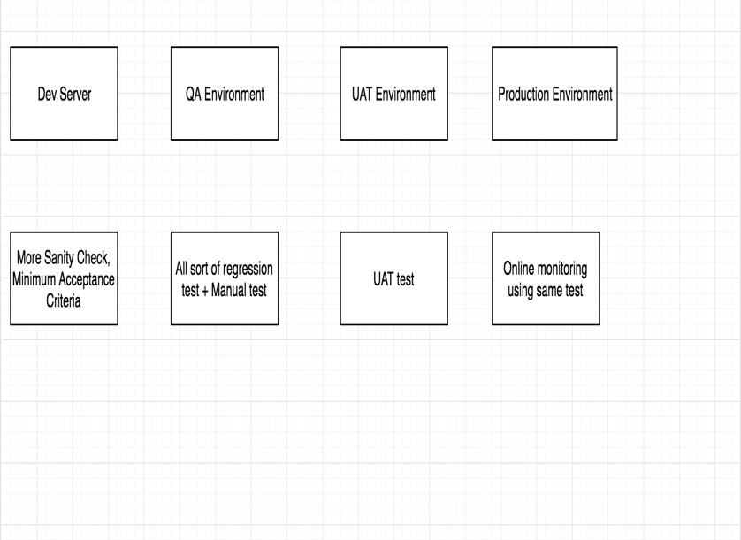

# Quality Testing

I will appreciate  ***Michael Bolton** & ***Margaret Dineen**  for pairing and sharing their knowledge :
<br />
<br />
<br />
<br />

## Current Situation :
- not seeing improved quality
- not seeing improved productivity
- not seeing improved user sentiment


<br />
<br />
<br />
<br />

## Business Demands :  
 ### As a Business, we want to release reliable software more frequently in order to remain competitive
- Setting up a delivery pipeline with the appropriate levels of maintainable automation AND manual testing required to support continuous delivery which ensure the stability of product as per project needs AND the culture to support them doesn’t happen overnight
<br />
<br />
<br />
<br />

## What is Quality : value to some person(s) who matter(s).
### What a customer thinks of as quality, what a programmer thinks of as quality, what a business owner thinks of as quality those are all different.

- To a **customer**, a quality product is one that delivers value; helps the customer gets something done without problems or friction.
- To a **developer**, a quality product is one that is easy to develop and maintain; readable, understandable code. little friction when trying to add new features or fix bugs.
- To a **product owner/project manager**, a quality product is one that they can ship on time to make the business and the customers happy.
<br />
<br />
<br />
<br />

## Does Testing improves quality ? 
 -  If we omits testing, the quality of a product (typically) will be A) Better B) Worse C) Indifferent? ( where A, B, C are different dimensions) Only one sensible answer exists. This makes testing necessary, but not sufficient, cause of quality. 
<br />
<br />
<br />
<br />

## What is Software Testing :
### The role of Software testing is to find problems, assess quality in certain dimensions, analysing risk. Test results/Reports are feedback to team to make empirically informed decisions about the product, project, or business.
 - Testing is questioning the product  in order to evaluate it
 - Testing is a process of empirical, technical, investigation done on behalf of stakeholders with the intention of revealing quality-related information of the kind that they seek 

<br />
<br />
<br />
<br />

## Who own Quality ?

- The agile team owns the quality of the deliverables it produces and the quality of the processes it embraces
- The agile team can impact the quality of other components that its deliverables interact with
- You can only take ownership of what you can control but if there are other areas - including process - that are impacting your deliverables and your ability to meet business needs then YOU NEED TO FIX THEM


## Impact of Software Quality in agile team 


## What impacts software quality in my environment


                             


## Where do we start building Quality in team ?


Sincere thanks to Margaret for pairing up to come up with above diagram.


<br />
<br />
<br />
<br />

# Current Business Risks:


- Are we  actually building what we think we're building?

```
A serious source of business risk is that the team does not have good ways of making sure that what they are building is what they intend to build

``` 
- The point is that quality above which is production at the customer level, absolutely depends on stability below which is  QA Server

```
Team who focus is to build continuous testing is a steps closure CI/CD and even get automated feedback of test. This is ideal scenario regarding team expectation from us while building continuous testing:
```
 
- To build a continuous agile team need to focus on below things :


```
- How to prevent bugs ? Doing a RCA analysis of bugs and ask developer to improve unit test, Ask tester to implement automated test, add test cases for manual tester and analyse how to improve process so that this bugs can never occurs.
- How to reduce manual effort ? – Placing right automated test.
- How to make QA server more stable ? – Doing more test in dev environment and feature branch (In feature branch people create a separate environment to test only changes for new feature)
- Existing features/Software version - Find out critical flow working/agreed with team and manually test them until it automated for existing versions.
- Why less manual testing in agile team - To make sure existing changes and new changes are working as expected team cannot complete in sprint and manual testing is very slow and unreliable process to share feedback with team.
```

- Unit Test 

 ```
 Bugs are a pain for everyone, Including the developers.I don't know any developers who like to go back and fix bugs. Unit checks are a pain too.

 The question is:  are they a bigger pain than the consequences of having bugs get built into the product, and buried so that they explode much later on? For any given bit of code, we don't know that! But we can guess. The key is to, as a team, to adapt and tune our behaviour when our guesses turn out to be bad guesses.

- Time all the developers spend fixing bugs
- Time maintainence team spend trying to find where they have to go to fix the bugs
- Time developer spend trying to help customers through bugs
- Time do customers spend trying to work around bugs .. or doing research and communication
** If we calculate total time/money/resources spent  because of one bugs miss and  fixing/ workaround is huge than writing a unit test in first place.

```

- Quality above reduces dependence on expensive high-level testing : 
```
Very few unit tests, some UI test, lots of QA tests and lots of manual tests
QA has created an automated test suite, but the development team has not. It will be very long running and flakey because the development team has not helped build the suite or architect the application in a way that makes it easy to test. It is broken by the devs very regularly and they are relying on the QA department to fix it. There is probably both a manual test and an automated test. There is likely not enough trust in the test suite so regression is being performed twice, once manually and once automatically, because of this double work and because of the extra hand-offs between the testing this approach has made the company go slower. (Current Situation in agile team)

```

- Inexpensive low-level testing reduces dependence on expensive high-level testing.

- Risk grows toward the user.


<br />
<br />
<br />
<br />

## Clarification

- **Proportion of testing**: There is no right proportion of using different testing technique. It completely depends on project state / needs. 
   1. Stakeholder Satisfaction
   2. Deliver on Time
   3. Deliver on Budget
   4. Deliver all planned scope
   5. Meet Quality Requirements
   6. Team Satisfaction


